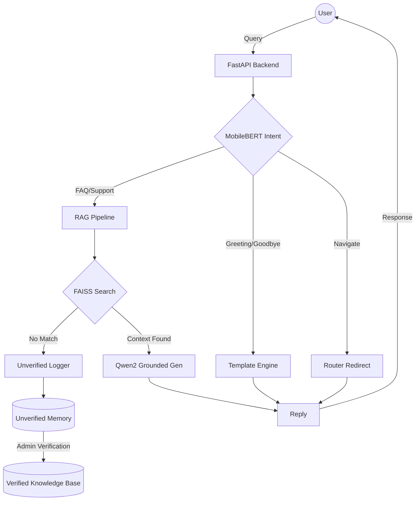

# 🤖 RAG-First Customer Care Bot

[](https://www.python.org/)
[](https://reactjs.org/)
[](https://github.com/facebookresearch/faiss)
[](https://huggingface.co/Qwen/Qwen2-0.5B-Instruct)

A premium, modular Customer Care Assistant built with a **3-Stage Hybrid RAG Pipeline**. This system prioritizes accuracy and groundedness by using local LLMs to generate responses strictly from your verified knowledge base.

---

## 🚀 Key Features

- **🌐 System-Specific Knowledge**: Isolated knowledge bases for different departments or products (e.g., eHAJIRI, TourBooking).
- **📄 Multi-Format Ingestion**: Batch process PDFs, DOCX, PPTX, and TXT files directly into high-performance vector stores.
- **🧠 3-Stage Hybrid Architecture**:
    - **Stage 0 (Intent)**: Real-time classification (Greeting, FAQ, Support, Goodbye, Navigate) using **MobileBERT**.
    - **Stage 1 (Retrieve)**: Semantic search via FAISS & Sentence-Transformers with citation scrubbing.
    - **Stage 2 (Grounded Gen)**: LLM responses powered by **Qwen2-0.5B-Instruct**, strictly anchored to your documents.
    - **Stage 3 (Fallback)**: Graceful fallback with "unverified memory" logging when no relevant context is found.
- **🛠️ Learning Loop (Admin Dashboard)**: Paginated chat history per system, allowing admins to review, edit, and promote interactions to the permanent knowledge base.
- **⚡ Local-First Inference**: Designed to run entirely on local hardware (CPU/GPU) using optimized model architectures.
- **🎨 Premium UI**: A modern, responsive dashboard with dynamic system management and real-time history filtering.

---

## 🏗️ System Architecture


---

## 🚦 Getting Started

### 1. Backend Setup (ai-services)
```bash
cd ai-services
python -m venv venv
.\venv\Scripts\activate  # Windows
pip install -r requirements.txt
# Create .env file and set ADMIN_TOKEN
python app.py
```
*Note: The first run will download ~1GB of model weights.*

### 2. Frontend Setup (Frontend)
```bash
cd Frontend/frontend
npm install
npm run dev
```

---

## 📖 API Documentation

Detailed documentation is available in **[API_REFERENCE.md](./API_REFERENCE.md)**.

| Endpoint | Method | Description |
| :--- | :--- | :--- |
| `/process` | `POST` | Main chat entry point (aliased as `/chat`) |
| `/upload` | `POST` | Initialize a new Knowledge Base with files |
| `/knowledge-bases/<name>/append` | `POST` | Add more documents to an existing system |
| `/chat-history` | `GET` | Paginated logs of unverified AI interactions |
| `/unverified/update` | `POST` | Verify and promote a memory item to KB |
| `/knowledge-bases` | `GET` | List all active Knowledge Systems |
| `/stats` | `GET` | Get current vector store statistics |
| `/clear-cache` | `POST` | Manually clear model memory (RAM/VRAM) |

---

## 🤝 Contributing
1. Fork the project.
2. Create your Feature Branch (`git checkout -b feature/AmazingFeature`).
3. Commit your changes (`git commit -m 'Add some AmazingFeature'`).
4. Push to the branch.
5. Open a Pull Request.
---
## 📄 License
Distributed under the MIT License. Developed by Rujin Manandhar.
