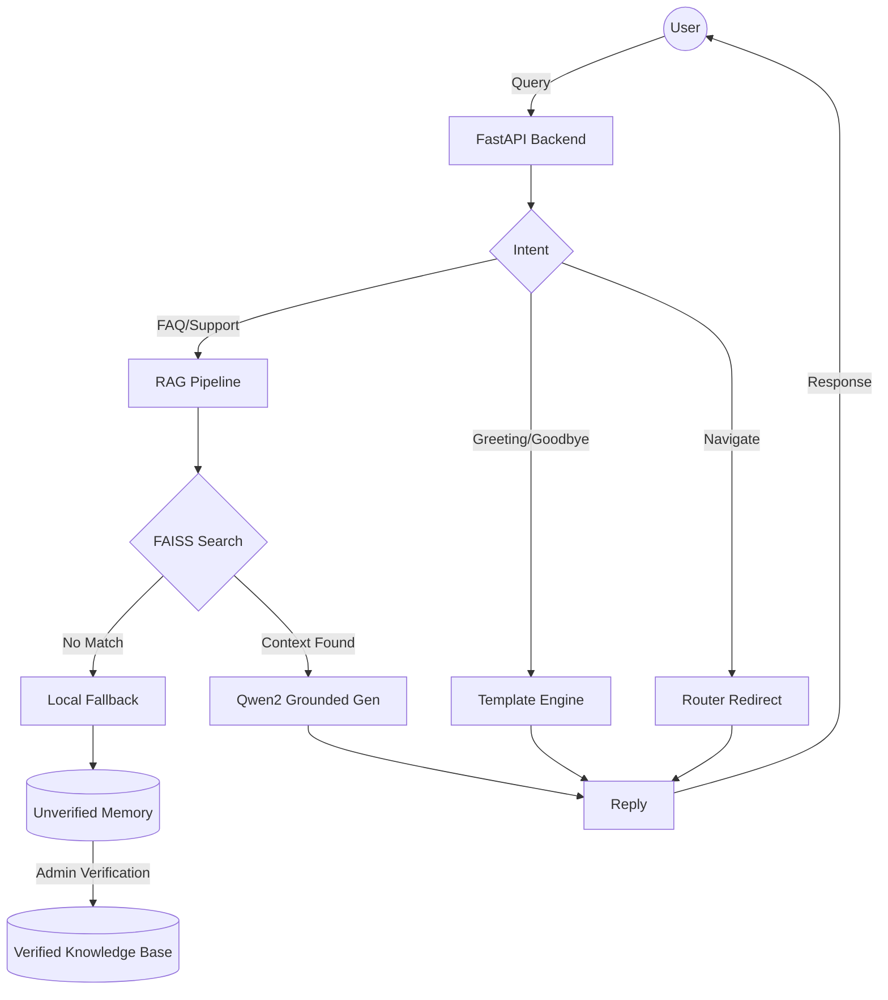

# 🤖 RAG-First Customer Care Bot

[](https://www.python.org/)
[](https://reactjs.org/)
[](https://github.com/facebookresearch/faiss)
[](https://huggingface.co/Qwen/Qwen2-0.5B-Instruct)

Next-Generation RAG Support Engine | 3-stage hybrid architecture: intent classification, FAISS-based semantic grounding, and Qwen2-driven self-optimization. Engineered for ultra-precise local execution featuring a professional React administrative control center.

---

## 🚀 Key Features

- **🌐 System-Specific Knowledge**: Isolated knowledge bases for different departments or products (e.g., eHAJIRI, TourBooking).
- **📄 Multi-Format Ingestion**: Batch process PDFs, DOCX, PPTX, and TXT files directly into high-performance vector stores.
- **🧠 3-Stage Hybrid Architecture**:
    - **Stage 0 (Intent)**: Real-time classification (Greeting, FAQ, Support, Goodbye, Navigate).
    - **Stage 1 (Retrieve)**: Semantic search via FAISS & Sentence-Transformers with citation scrubbing.
    - **Stage 2 (Grounded Gen)**: LLM responses powered by **Qwen2-0.5B-Instruct**, strictly anchored to your documents.
    - **Stage 3 (Fallback)**: Graceful fallback with "unverified memory" logging when no relevant context is found.
- **🛠️ Learning Loop (Admin Dashboard)**: Paginated chat history per system, allowing admins to review, edit, and promote interactions to the permanent knowledge base.
- **⚡ Local-First Inference**: Designed to run entirely on local hardware (CPU/GPU) using optimized model architectures.
- **🎨 Premium UI**: A modern, responsive dashboard with dynamic system management and real-time history filtering.

---

## 🏗️ System Architecture


---

## 🛠️ Installation & Setup

Follow these steps to set up the project on your local machine.

### 📋 Prerequisites

Before you begin, ensure you have the following installed:
- **Python 3.14.3**: [Download here](https://www.python.org/downloads/)
- **Node.js (v16+) & NPM**: [Download here](https://nodejs.org/)
- **Git**: [Download here](https://git-scm.com/)

---

### 1. Backend Setup (`ai-services`)

The backend handles AI processing, vector storage, and document ingestion.

1.  **Navigate to the backend directory**:
    ```bash
    cd ai-services
    ```

2.  **Create a Virtual Environment**:
    This keeps dependencies isolated from your global Python installation.
    ```bash
    python -m venv venv or py -3.14 -m venv venv (if you have multiple python versions)
    ```

3.  **Activate the Virtual Environment**:
    - **Windows**:
      ```bash
      .\venv\Scripts\activate
      ```
    - **Mac/Linux**:
      ```bash
      source venv/bin/activate
      ```

4.  **Install Dependencies**:
    ```bash
    pip install -r requirements.txt
    ```

5.  **Configure Environment Variables**:
    Create a file named `.env` in the `ai-services` folder and add the following:
    ```env
    ADMIN_TOKEN=admin123
    ```

6.  **Run the Backend Server**:
    ```bash
    python app.py
    ```
    > [!NOTE]
    > On the first run, the system will download approximately **1GB** of model weights (Sentence-Transformers and Qwen2). Please ensure you have a stable internet connection.

---

### 2. Frontend Setup (`Frontend`)

The frontend provides the user interface for chatting and administration.

1.  **Open a new terminal window** (keep the backend terminal running).

2.  **Navigate to the frontend directory**:
    ```bash
    cd Frontend/frontend
    ```

3.  **Install NPM Packages**:
    ```bash
    npm install
    ```

4.  **Start the Development Server**:
    ```bash
    npm run dev
    ```

---

### 3. Verification

1.  **Access the Dashboard**: Open your browser and go to `http://localhost:5173`.
2.  **Verify Backend**: Go to `http://localhost:8001/CustomerCare/health`. You should see `{"status": "healthy", ...}`.
3.  **Initialize Knowledge**:
    - Navigate to the **Systems Registry** page in the UI.
    - Upload a PDF or TXT file to the "General" system to populate the vector store.
    - Start chatting!


---

## 🐳 Docker Deployment (Optional)

To run the backend in a containerized environment:

1.  **Build the Image**:
    ```bash
    docker build -t rag-backend ./ai-services
    ```

2.  **Run the Container**:
    ```bash
    docker run -d -p 8001:8001 --env-file ./ai-services/.env --name rag-ai rag-backend
    ```

> [!TIP]
> **Maintenance & Cleanup**: To reclaim disk space by removing unused images, containers, and build cache, run:
> ```bash
> docker system prune -f
> ```

---

## 📖 API Documentation

Detailed documentation is available in **[API_REFERENCE.md](./API_REFERENCE.md)**.

| Endpoint | Method | Description |
| :--- | :--- | :--- |
| `/process` | `POST` | Main chat entry point (aliased as `/chat`) |
| `/upload` | `POST` | Initialize a new Knowledge Base with files |
| `/knowledge-bases/<name>/append` | `POST` | Add more documents to an existing system |
| `/chat-history` | `GET` | Paginated logs of unverified AI interactions |
| `/unverified/update` | `POST` | Verify and promote a memory item to KB |
| `/knowledge-bases` | `GET` | List all active Knowledge Systems |
| `/stats` | `GET` | Get current vector store statistics |
| `/clear-cache` | `POST` | Manually clear model memory (RAM/VRAM) |

---

## 🤝 Contributing
1. Fork the project.
2. Create your Feature Branch (`git checkout -b feature/AmazingFeature`).
3. Commit your changes (`git commit -m 'Add some AmazingFeature'`).
4. Push to the branch.
5. Open a Pull Request.
---
Developed by Rujin Manandhar.
