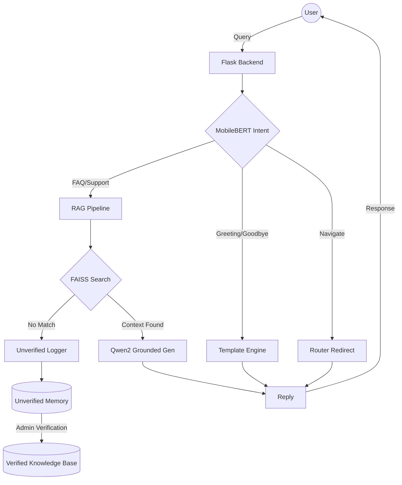

# 🤖 RAG-First Customer Care Bot

[](https://www.python.org/)
[](https://reactjs.org/)
[](https://github.com/facebookresearch/faiss)
[](https://huggingface.co/Qwen/Qwen2-0.5B-Instruct)

A premium, modular Customer Care Assistant built with a **3-Stage Hybrid RAG Pipeline**. This system prioritizes accuracy and groundedness by using local LLMs to generate responses strictly from your verified knowledge base.

---

## 🚀 Key Features

- **📄 Multi-Format Ingestion**: Batch process PDFs, DOCX, PPTX, and TXT files directly into a high-performance vector store.
- **🧠 3-Stage Hybrid Architecture**:
    - **Stage 0 (Intent)**: Real-time classification (Greeting, FAQ, Support, Goodbye, Navigate) using **MobileBERT**.
    - **Stage 1 (Retrieve)**: Semantic search via FAISS & Sentence-Transformers with high-confidence thresholds.
    - **Stage 2 (Grounded Gen)**: LLM responses powered by **Qwen2-0.5B-Instruct**, strictly anchored to your uploaded documents to prevent hallucinations.
    - **Stage 3 (Fallback)**: Graceful fallback with "unverified memory" logging when no relevant context is found.
- **🛠️ Self-Learning Mechanism**: Fallback queries are saved as "unverified" items, allowing admins to review, edit, and promote them to the permanent knowledge base.
- **⚡ Local-First Inference**: Designed to run entirely on local hardware (CPU/GPU) using optimized model architectures.
- **🎨 Premium UI**: A modern, responsive dashboard built with React, Vite, and Tailwind CSS.

---

## 🏗️ System Architecture



---

## 🛠️ Tech Stack

### Backend (AI Services)
- **Framework**: Flask (Python)
- **Vector DB**: Meta FAISS
- **Embeddings**: `sentence-transformers/all-MiniLM-L6-v2`
- **Intent Classifier**: `google/mobilebert-uncased`
- **Grounded Generation**: `Qwen/Qwen2-0.5B-Instruct` (Local)
- **Hardware Acceleration**: Support for CUDA (GPU) and high-performance CPU (float32/float16)

### Frontend
- **Framework**: React.js (Vite)
- **Styling**: Vanilla CSS (Premium Dark Mode)
- **Icons**: Lucide React
- **Animations**: Framer Motion

---

## 🚦 Getting Started

### Prerequisites
- Python 3.9+
- Node.js 18+

### 1. Backend Setup
```bash
cd ai-services
python -m venv venv
# On Windows:
.\venv\Scripts\activate
# On Linux/macOS:
source venv/bin/activate

# Install requirements
pip install -r requirements.txt
```

Run the server:
```bash
python app.py
```
*Note: The first run will download ~1GB of model weights for Qwen2 and MobileBERT.*

### 2. Frontend Setup
```bash
cd Frontend/frontend
npm install
npm run dev
```

---

## 📖 API Documentation

| Endpoint | Method | Description |
| :--- | :--- | :--- |
| `/chat` | `POST` | Process user query through the 3-stage pipeline |
| `/upload` | `POST` | Batch upload documents (PDF, DOCX, etc.) |
| `/unverified` | `GET` | Fetch items in the self-learning queue |
| `/unverified/update` | `POST` | Verify and promote a memory item to KB |
| `/stats` | `GET` | Get current vector store statistics |
| `/reset` | `POST` | Clear the knowledge base and reset models |

---

## 🤝 Contributing
1. Fork the project.
2. Create your Feature Branch (`git checkout -b feature/AmazingFeature`).
3. Commit your changes (`git commit -m 'Add some AmazingFeature'`).
4. Push to the branch (`git push origin feature/AmazingFeature`).
5. Open a Pull Request.

---

## 📄 License
Distributed under the MIT License. See `LICENSE` for more information.

Developed by Rujin Manandhar
