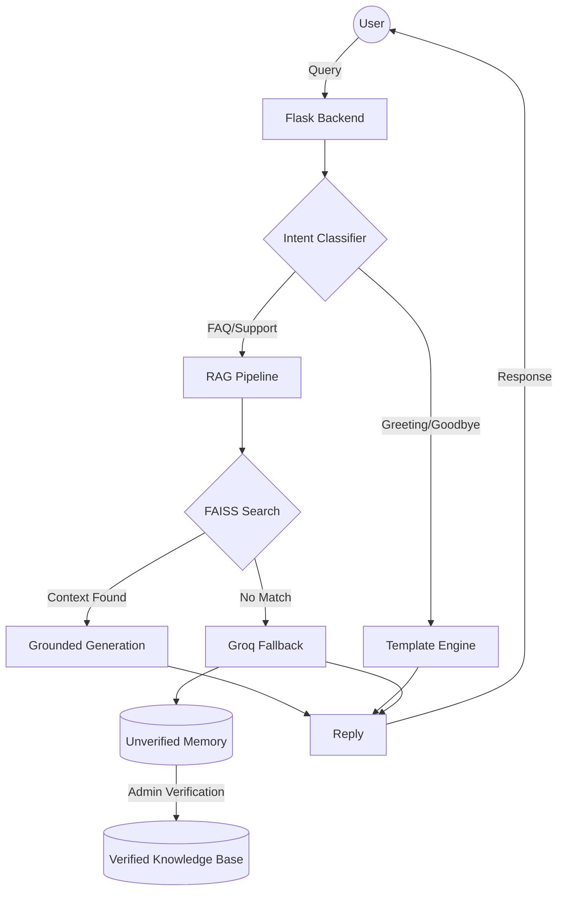

# 🤖 RAG-First Customer Care Bot

[](https://www.python.org/)
[](https://reactjs.org/)
[](https://github.com/facebookresearch/faiss)
[](https://groq.com/)

A premium, modular Customer Care Assistant built with a **3-Stage Hybrid RAG Pipeline**. This system prioritizes accuracy and groundedness by retrieving from a verified knowledge base before falling back to general-purpose LLMs.

---

## 🚀 Key Features

- **📄 Multi-Format Ingestion**: Batch process PDFs, DOCX, PPTX, and TXT files directly into a high-performance vector store.
- **🧠 3-Stage Hybrid Architecture**:
    - **Stage 0 (Intent)**: Real-time classification (Greeting, FAQ, Support, Goodbye) using TinyBERT.
    - **Stage 1 (Retrieve)**: Semantic search via FAISS & Sentence-Transformers with high-confidence thresholds.
    - **Stage 2 (Grounded Gen)**: LLM responses strictly anchored to your uploaded documents to prevent hallucinations.
    - **Stage 3 (Fallback)**: Graceful fallback to Groq Llama-3.1 for general queries with "unverified memory" logging.
- **🛠️ Self-Learning Mechanism**: Fallback responses are saved as "unverified" items, allowing admins to review, edit, and promote them to the permanent knowledge base.
- **⚡ Performance First**: Optimized with asynchronous processing, local embedding caching, and sub-second latency tracking.
- **🎨 Premium UI**: A modern, responsive dashboard built with React, Vite, and Tailwind CSS.

---

## 🏗️ System Architecture



---

## 🛠️ Tech Stack

### Backend (AI Services)
- **Framework**: Flask (Python)
- **Vector DB**: Meta FAISS
- **Embeddings**: `sentence-transformers/all-MiniLM-L6-v2`
- **Intent**: `huawei-noah/TinyBERT_General_4L_312D`
- **Inference**: Groq SDK (Llama-3.1-8B)
- **Local Fallback**: GPT-2 (124M)

### Frontend
- **Framework**: React.js (Vite)
- **Styling**: Tailwind CSS
- **Icons**: Lucide React
- **Animations**: Framer Motion

---

## 🚦 Getting Started

### Prerequisites
- Python 3.9+
- Node.js 18+
- [Groq API Key](https://console.groq.com/)

### 1. Backend Setup
```bash
cd ai-services
python -m venv venv
source venv/bin/activate  # On Windows: venv\Scripts\activate
pip install -r requirements.txt
```
Create a `.env` file in `ai-services/`:
```env
GROQ_API_KEY=your_key_here
```
Run the server:
```bash
python app.py
```

### 2. Frontend Setup
```bash
cd Frontend/frontend
npm install
npm run dev
```

---

## 📖 API Documentation

| Endpoint | Method | Description |
| :--- | :--- | :--- |
| `/chat` | `POST` | Process user query through the 3-stage pipeline |
| `/upload` | `POST` | Batch upload documents (PDF, DOCX, etc.) |
| `/unverified` | `GET` | Fetch items in the self-learning queue |
| `/stats` | `GET` | Get current vector store statistics |
| `/reset` | `POST` | Clear the knowledge base |

---

## 🤝 Contributing
1. Fork the project.
2. Create your Feature Branch (`git checkout -b feature/AmazingFeature`).
3. Commit your changes (`git commit -m 'Add some AmazingFeature'`).
4. Push to the branch (`git push origin feature/AmazingFeature`).
5. Open a Pull Request.

---

## 📄 License
Distributed under the MIT License. See `LICENSE` for more information.

Developed with ❤️ by the RAG-Bot Team.
