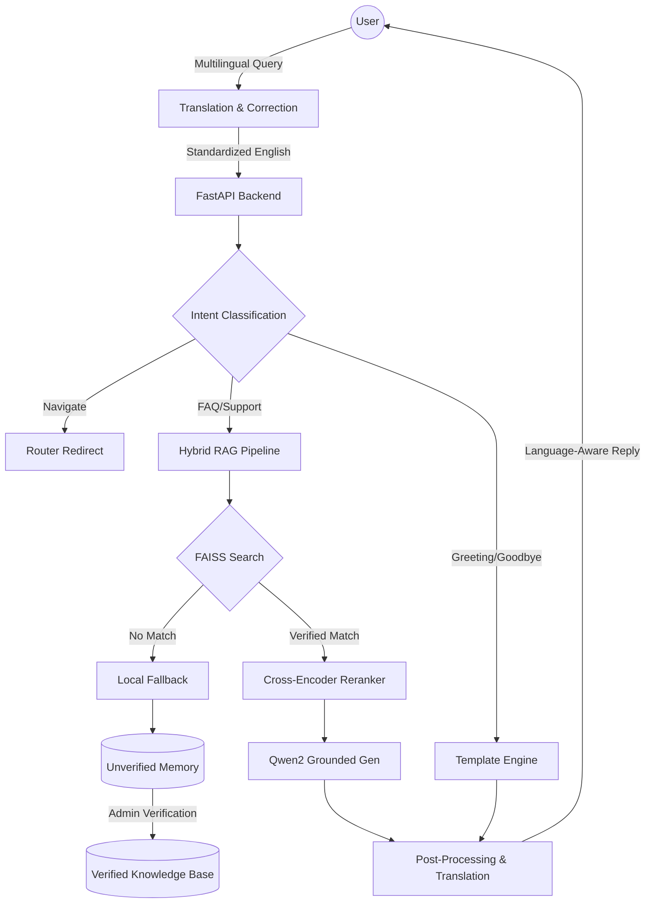

# 🤖 RAG-First Customer Care Bot

[](https://www.python.org/)
[](https://fastapi.tiangolo.com/)
[](https://reactjs.org/)
[](https://github.com/facebookresearch/faiss)
[](https://huggingface.co/Qwen/Qwen2-0.5B-Instruct)
[](/docs)

A high-precision, production-ready Customer Service framework powered by a **3-stage Hybrid RAG Pipeline**. Features multilingual support (English, Devanagari, Romanized Nepali), intelligent typo correction, and a secure administrative learning loop for continuous knowledge improvement.

---

## 🚀 Key Features

- **🌐 Multilingual Native Support**: Native processing for English, Devanagari Nepali, and Romanized Nepali (Nepglish) with automated transliteration and translation.
- **🔍 Typo-Tolerant Pipeline**: Intelligent query processing using `rapidfuzz` to correct domain-specific terminology (e.g., "eHajri", "Payroll") even in transliterated inputs.
- **📄 Multi-Format Ingestion**: Batch process PDFs, DOCX, PPTX, and TXT files directly into high-performance vector stores.
- **🧠 3-Stage Hybrid Architecture**:
    - **Stage 0 (Intent)**: Real-time classification (Greeting, FAQ, Support, Goodbye, Navigate) using fuzzy logic.
    - **Stage 1 (Retrieve)**: Semantic search via FAISS & Sentence-Transformers with cross-encoder re-ranking for maximum precision.
    - **Stage 2 (Grounded Gen)**: LLM responses powered by **Qwen2-0.5B-Instruct**, strictly anchored to verified documents.
- **🔐 Dual-Token Security**: Role-based access control with separate tokens for Administrative actions and Chat interactions.
- **🛠️ Administrative Learning Loop**: A professional React dashboard to review unverified interactions, edit responses, and promote them to the permanent knowledge base.
- **⚡ Local-First Inference**: Designed for high-speed local execution on CPU/GPU using optimized model weights.

---

## 🏗️ System Architecture



---

## 🛠️ Installation & Setup

### 📋 Prerequisites

- **Python 3.14.3+**
- **Node.js (v16+) & NPM**
- **Git**

---

### 1. Backend Setup (`ai-services`)

1.  **Navigate and Create Venv**:
    ```bash
    cd ai-services
    python -m venv venv
    .\venv\Scripts\activate  # Windows
    source venv/bin/activate # Mac/Linux
    ```

2.  **Install Dependencies**:
    ```bash
    pip install -r requirements.txt
    ```

3.  **Configure Security**:
    Create a `.env` file in the `ai-services` folder:
    ```env
    ADMIN_TOKEN=your-admin-secret-token
    CHAT_TOKEN=your-chat-access-token
    ```

4.  **Run the Server**:
    ```bash
    python app.py
    ```
    > [!NOTE]
    > On first run, the system downloads ~1.5GB of model weights (NLLB, Sentence-Transformers, Qwen2).

---

### 2. Frontend Setup (`Frontend`)

1.  **Navigate and Install**:
    ```bash
    cd Frontend/frontend
    npm install
    ```

2.  **Start Development Server**:
    ```bash
    npm run dev
    ```

---

## 📖 API Documentation (Swagger)

The system features interactive API documentation. Once the backend is running, access:
- **Swagger UI**: [http://localhost:8001/docs](http://localhost:8001/docs)
- **ReDoc**: [http://localhost:8001/redoc](http://localhost:8001/redoc)

### Core Endpoints

| Tag | Endpoint | Method | Description |
| :--- | :--- | :--- | :--- |
| **Chat** | `/CustomerCare/chat` | `POST` | Main entry point for user queries |
| **Knowledge** | `/CustomerCare/upload` | `POST` | Create a new KB from files |
| **Knowledge** | `/CustomerCare/knowledge-bases` | `GET` | List all available systems |
| **Memory** | `/CustomerCare/chat-history` | `GET` | Retrieve unverified interactions |
| **Memory** | `/CustomerCare/unverified/update` | `POST` | Verify and promote a memory item |
| **System** | `/CustomerCare/health` | `GET` | Service status check |

---

## 🐳 Docker Deployment

1.  **Build**: `docker build -t rag-backend ./ai-services`
2.  **Run**: `docker run -d -p 8001:8001 --env-file ./ai-services/.env --name rag-ai rag-backend`

---

Developed with ❤️ by Rujin Manandhar.
